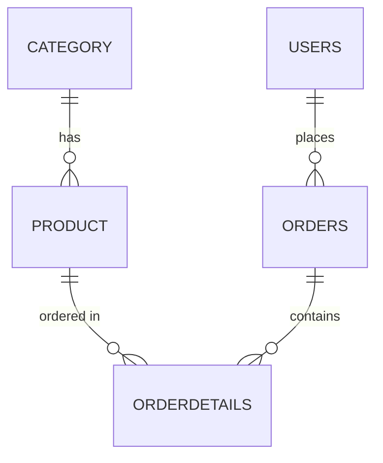

# 🛒 Hibernate ORM Implementation — E-Commerce System

## 🎯 Objective

Develop a **Hibernate-based Java application** to manage an e-commerce system with the following entities:

`Category` · `Product` · `Users` · `Orders` · `OrderDetails`

Implement relationships among these entities and configure Hibernate to persist data in a relational database.

---

## 📋 Tasks

### 1. Set Up Hibernate Project

- [ ] Create a Maven/Gradle project
- [ ] Add dependencies for Hibernate, MySQL (or H2 for in-memory database), and any required libraries
- [ ] Configure `hibernate.cfg.xml` or `application.properties` for the database connection

---

### 2. Define Entities & Relationships

#### 📁 Category

| Field | Details |
|---|---|
| `id` | Primary Key, auto-generated |
| `name` | Unique, Not Null |
| `description` | — |

**Relationship:** One-to-Many with `Product`

---

#### 📦 Product

| Field | Details |
|---|---|
| `id` | Primary Key, auto-generated |
| `name` | Not Null |
| `price` | Decimal, Not Null |
| `stockQuantity` | Integer |

**Relationship:** Many-to-One with `Category`

---

#### 👤 Users

| Field | Details |
|---|---|
| `id` | Primary Key, auto-generated |
| `username` | Unique, Not Null |
| `password` | Hashed, Not Null |
| `email` | Unique, Not Null |
| `role` | `ADMIN`, `CUSTOMER` |

**Relationship:** One-to-Many with `Orders`

---

#### 🧾 Orders

| Field | Details |
|---|---|
| `id` | Primary Key, auto-generated |
| `orderDate` | Timestamp, Not Null |
| `totalAmount` | Decimal, Not Null |

**Relationships:**
- Many-to-One with `Users`
- One-to-Many with `OrderDetails`

---

#### 📑 OrderDetails

| Field | Details |
|---|---|
| `id` | Primary Key, auto-generated |
| `quantity` | Integer, Not Null |
| `unitPrice` | Decimal, Not Null |

**Relationships:**
- Many-to-One with `Orders`
- Many-to-One with `Product`

---

### 3. Implement Entity Mappings

- [ ] Use JPA annotations: `@Entity`, `@Table`, `@Id`, `@GeneratedValue`, `@ManyToOne`, `@OneToMany`, etc.
- [ ] Ensure **cascading** and **fetching strategies** are properly defined

---

### 4. Configure Hibernate & Test Database Operations

- [ ] Implement `HibernateUtil.java` to manage the `SessionFactory`
- [ ] Perform CRUD operations:
  - [ ] Insert new Categories, Products, Users
  - [ ] Create Orders with multiple OrderDetails
  - [ ] Fetch Orders along with associated Users and Products

---

### 5. Bonus (Optional Enhancements) ✨

- [ ] Implement **Named Queries** for fetching products by category
- [ ] Implement **Criteria Queries** using `CriteriaBuilder`
- [ ] Add **soft delete** functionality using a `deleted` flag instead of physical deletion
- [ ] Implement **pagination** for product listings

---

## 📤 Submission Guidelines

Submit a **GitHub repository link** containing:

- ✅ Java source files (`.java`)
- ✅ `pom.xml` or `build.gradle`
- ✅ Database schema or `schema.sql`
- ✅ Test cases for CRUD operations
- ✅ `README.md` with setup instructions and execution guide

---

## 🏆 Evaluation Criteria

| Criterion | Focus |
|---|---|
| **Entity Relationships** | Correctness and completeness |
| **Hibernate ORM Usage** | Proper annotations and mappings |
| **CRUD Operations** | Functional, with correct data persistence |
| **Code Quality** | Readability and best practices |

---

## 🗺️ Entity Relationship Overview

